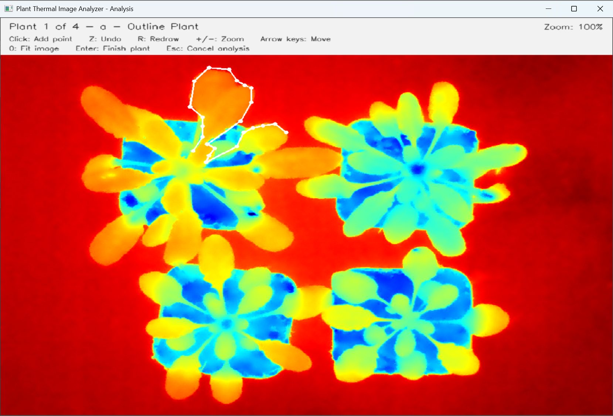
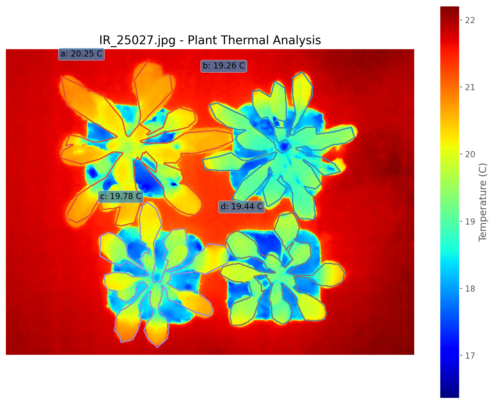

# Plant Thermal Image Analyzer

A GUI-based tool for quantitative analysis of radiometric FLIR thermal images using manually defined regions of interest (ROIs).

Originally developed for plant thermal imaging applications.

Developed by **Kathy Yu Xuan Gu**  
Schroeder Laboratory  
University of California San Diego

---

## Overview

Plant Thermal Image Analyzer provides a simple workflow for extracting and comparing surface temperatures from radiometric FLIR JPG images.

Users can manually outline individual plants or other regions of interest (ROIs), allowing images with different numbers, sizes, and arrangements to be analyzed without requiring a predefined layout.

The program calculates temperature statistics for each selected region and automatically generates summary tables, masks, and visualization images.

---

## Download

Pre-built applications for **Windows** and **macOS** are available from the **Releases** section of this repository.

No Python installation is required when using the pre-built application.

### Windows

1. Go to **Releases** and open the latest release.
2. Download `PlantThermalImageAnalyzer-v1.0-Windows.zip`.
3. Extract the ZIP file.
4. Open the extracted `PlantThermalImageAnalyzer` folder.
5. Double-click `PlantThermalImageAnalyzer.exe` to start the program.

> Keep all extracted files in the same folder when running the application.

### macOS

1. Go to **Releases** and open the latest release.
2. Download `PlantThermalImageAnalyzer-v1.0-macOS.dmg`.
3. Open the downloaded DMG file.
4. Open **Plant Thermal Image Analyzer**.

> **First launch on macOS:** The current macOS build is not notarized by Apple. If macOS blocks the application, go to **System Settings → Privacy & Security** and select **Open Anyway**.

Users who want to inspect, modify, or run the Python source code can follow the **Run from Source** instructions below.

---

## Features

- Direct analysis of radiometric FLIR JPG images
- Manual polygon selection of individual plants or ROIs
- Supports any positive number of plants or regions
- Optional custom plant names or experimental labels
- Optional exclusion of soil or background regions
- Zoom and navigation controls for precise ROI selection
- Automatic calculation of:
  - Mean temperature
  - 2% trimmed mean temperature
  - Median temperature
  - Minimum temperature
  - Maximum temperature
  - Pixel count
- Automatic CSV summary output
- Individual ROI mask images
- QC visualization
- Annotated thermal analysis figure
- Plant names can be edited after analysis without repeating ROI selection

---

## Repository Structure

```text
Plant-Thermal-Image-Analyzer/
│
├── source_code/
│   └── plant_thermal_image_analyzer.py
│
├── conversion_tools/
│   ├── thermal_jpg_to_csv.py
│   └── thermal_jpg_to_fts.py
│
├── example_files/
│   ├── IR_25027.jpg
│   ├── IR_25027.csv
│   └── IR_25027.fts
│
├── images/
│   ├── manual_roi_selection.png
│   └── analysis_result.png
│
└── README.md
```

---

## How to Use

### 1. Open the Program

Launch the Windows or macOS application downloaded from GitHub Releases.

### 2. Select a Thermal Image

Click **Browse...** and select an original radiometric FLIR JPG image.

> The original radiometric JPG from the FLIR camera is required. Screenshots, exported images, or re-saved thermal images may no longer contain the embedded temperature data.

### 3. Enter the Number of Plants or ROIs

Enter the number of plants or regions that you want to analyze.

There is no predefined maximum number.

### 4. Add Custom Names (Optional)

Custom plant names or experimental labels can be assigned, for example:

```text
Control_1
Control_2
ABA_1
ABA_2
```

If custom names are not provided, the program automatically assigns default names such as `Plant 1`, `Plant 2`, etc.

### 5. Select an Output Folder

Choose where the analysis results should be saved.

If no output folder is selected, the program will create an `output` folder next to the input image.

### 6. Start Analysis

Click **Start Analysis**.

For each plant or ROI, manually outline the region by clicking around its boundary.



### ROI Selection Controls

| Control | Function |
|---|---|
| Left click | Add a point |
| `Z` | Undo the last point |
| `R` | Redraw the current polygon |
| `+` / `-` | Zoom in / out |
| Arrow keys | Move around the image |
| `0` | Return to full-image view |
| `Enter` | Finish the current plant |
| `Esc` | Cancel analysis |

At least three points are required to define a region.

### 7. Review the Selected Region

After outlining a plant or ROI, the program displays the selected mask.

You can:

- Press `Enter` or `A` to accept the selection
- Press `R` to redraw the region
- Press `E` to exclude soil or background from the selected region
- Press `Esc` to cancel the analysis

Repeat this process for each plant or ROI.

---

## Analysis Output

After all regions are selected, the program calculates temperature statistics and automatically saves the analysis results.

The output includes:

- Temperature summary CSV
- Individual ROI mask images
- QC mask visualization
- Annotated thermal analysis image

The CSV summary contains:

- Image name
- Plant number
- Plant name
- Mean temperature
- 2% trimmed mean temperature
- Median temperature
- Minimum temperature
- Maximum temperature
- Pixel count

### Example Analysis Result



The final analysis image displays the selected regions together with their calculated mean temperatures.

After analysis, plant names can also be edited without repeating ROI selection or recalculating the temperature measurements.

---

## Run from Source

Users who want to inspect, modify, or run the Python source code can use the version provided in the `source_code` folder.

### 1. Install Python

Python 3 is required.

### 2. Install Required Packages

Open Command Prompt on Windows or Terminal on macOS and run:

```bash
python -m pip install numpy opencv-python matplotlib flirimageextractor
```

### 3. Install ExifTool

ExifTool is required to extract radiometric temperature information embedded in FLIR JPG images.

Verify that ExifTool is available by running:

```bash
exiftool -ver
```

### 4. Run the Program

From the repository folder:

```bash
python source_code/plant_thermal_image_analyzer.py
```

The graphical user interface will open automatically.

---

## Thermal Image Conversion Tools

Two optional Python utilities are included in the `conversion_tools` folder.

These tools can be used independently of the main analyzer to extract the thermal temperature matrix from a radiometric FLIR JPG image.

### Requirements

Python 3 and ExifTool are required.

Install the required Python packages:

```bash
python -m pip install flirimageextractor numpy astropy
```

### FLIR JPG to CSV

Run:

```bash
python conversion_tools/thermal_jpg_to_csv.py
```

This extracts the thermal temperature matrix from the selected FLIR JPG and saves it as a `.csv` file.

### FLIR JPG to FTS

Run:

```bash
python conversion_tools/thermal_jpg_to_fts.py
```

This extracts the thermal temperature matrix from the selected FLIR JPG and saves it as an `.fts` file.

Both conversion tools use graphical file-selection windows, so users do not need to manually enter image paths.

---

## Example Files

The `example_files` folder contains example files that can be used to test the workflow:

```text
IR_25027.jpg
IR_25027.csv
IR_25027.fts
```

- `IR_25027.jpg` — example radiometric FLIR thermal image
- `IR_25027.csv` — extracted temperature matrix in CSV format
- `IR_25027.fts` — extracted temperature matrix in FTS format

---

## Important Notes

This software requires **radiometric FLIR JPG images containing embedded temperature data**.

A JPG that visually looks like a thermal image does not necessarily contain radiometric information. Screenshots, re-saved images, exported images, or images processed through other software may have lost the original temperature data.

The software was originally developed for plant thermal imaging, but manual ROI selection allows other compatible regions of interest to be analyzed.

DJI thermal R-JPEG images are not currently supported.

---

## Author

**Kathy Yu Xuan Gu**  
Schroeder Laboratory  
University of California San Diego

---

## Version

**Version 1.0**

Released for Windows and macOS.
